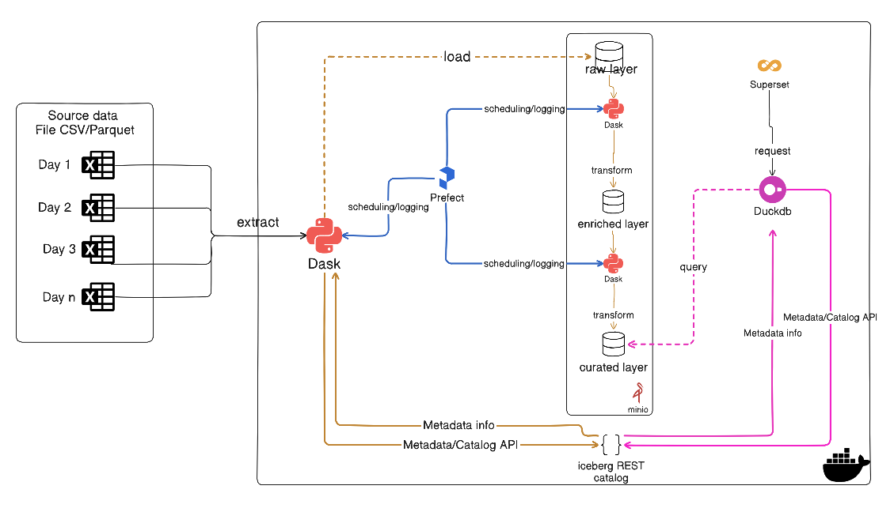
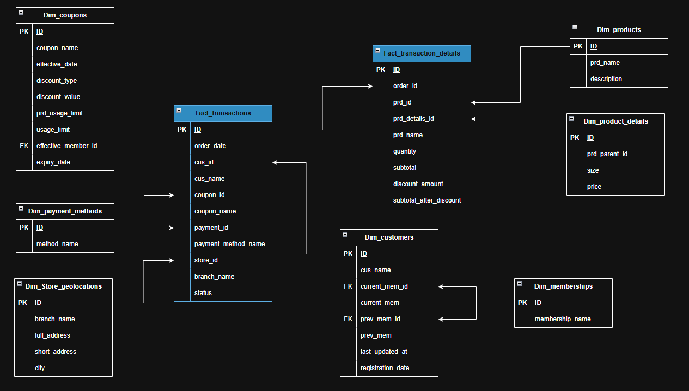

# HIGHLANDS COFFEE CUSTOMER DATA PLATFORM

### [Details documentation for this project](https://docs.google.com/document/d/1TFMjEwBEdsqwjRntoJBbdTxGBDMrZDT2P2ruBFSytm0/edit?tab=t.0)

## Project Overview
Highlands Coffee is a massive F&B franchise in Vietnam started in 1998 with approximately 900 store branches located all across the country till now. With average 150 customers each store served daily, that means roughly 135,000 customers total daily. Including take-away orders and customers who served on-site. 
With such an enormous number of loyal customers, it will result in an gigantic amount of data collected daily that Highlands Coffee needs to harvest and ultilize those “gold mine”.

## Business Requirements
- Technical:
    - System
- Non-technical:
    - sdfsdfsd
    - sdfsdfsdf

## Tech Stack
- Data Processing Engine: [**Dask(Python)**](https://docs.dask.org/en/stable/index.html)
- Workflow Orchestration: [**Prefect**](https://docs.prefect.io/v3/get-started)
- ACID Table Format: [**Apache Iceberg**](https://iceberg.apache.org/docs/nightly/)
- S3-compatible object storage: [**MinIO**](https://docs.min.io/enterprise/aistor-object-store/)
- In-memory high performance SQL engine: [**DuckDB**](https://duckdb.org/)

## Data Architecture

## Source Datasets
- Describe
- Database diagram here

## Data Modeling
- Describe

## Repository Structure
- `data/`: Contains raw and processed CSV files for orders and user summaries.
- `oltp_data/`: Includes source data files such as coupons, customers, geolocation, memberships, payment methods, product details, products, and transaction data in CSV and Excel formats.
- `doc_templates/`: Documentation templates for data engineering and project documentation.
- `intro.py`: Example Python script for data processing or analysis.
- `docker-compose.yml`: Configuration for containerized environments (if applicable).
- `README.md`: Project introduction and documentation.

## Getting Started
1. Clone this repository to your local machine.
2. Review the data files in the `data/` and `oltp_data/` folders.
3. Use the provided documentation templates to standardize your project documentation.
4. Run or modify the Python scripts to analyze or process the data as needed.

## Purpose
The main goal of this project is to enable efficient data engineering practices for Highlands Coffee, ensuring high-quality data management, reproducible analysis, and clear documentation.

---

Feel free to explore the repository and contribute to improving data workflows for Highlands Coffee!
