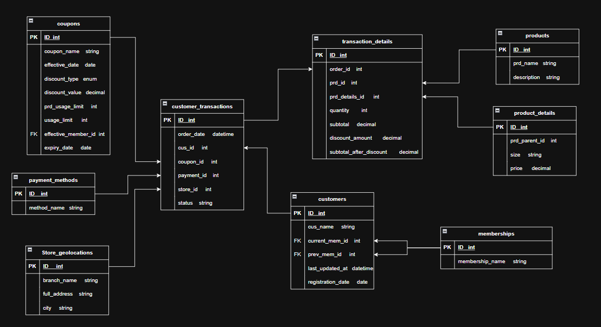

# HIGHLANDS COFFEE CUSTOMER DATA PLATFORM

### [Details documentation for this project](https://docs.google.com/document/d/1TFMjEwBEdsqwjRntoJBbdTxGBDMrZDT2P2ruBFSytm0/edit?tab=t.0)

## Project Overview
Highlands Coffee is a massive F&B franchise in Vietnam started in 1998 with approximately 900 store branches located all across the country till now. With average 150 customers each store served daily, that means roughly 135,000 customers total daily. Including take-away orders and customers who served on-site. 
With such an enormous number of loyal customers, it will result in an gigantic amount of data collected daily that Highlands Coffee needs to harvest and ultilize those “gold mine”.

## Business Requirements
1. Top hot products (Sản phẩm nổi bật)
    - Xác định danh sách các sản phẩm bán chạy nhất (Top N) dựa trên số lượng bán hoặc doanh thu.
    - Phân tích sản phẩm bán chạy theo khu vực hoặc thời gian (Ví dụ: Top 10 sản phẩm tháng trước).
    - Xác định các sản phẩm ít được quan tâm để xem xét việc ngừng bán hoặc đẩy mạnh khuyến mãi.
    - Phân tích mối quan hệ giữa kích cỡ và doanh số.
2. Customer Behavior (Hành vi khách hàng)
    - Xác định phân khúc khách hàng dựa trên thành viên.
    - Phân tích giá trị trọn đời của khách hàng (CLV) và tần suất mua hàng.
    - Xác định tỷ lệ chuyển đổi giữa các cấp độ thành viên để đánh giá hiệu quả chương trình thành viên.
    - Phân tích thói quen sử dụng coupon: Khách hàng nào thường xuyên dùng coupon, loại coupon nào được dùng nhiều nhất.
    - Phân tích phương thức thanh toán ưa thích theo từng nhóm khách hàng.
3. Sales Performance (Hiệu suất bán hàng)
    - Theo dõi tổng doanh thu, số lượng giao dịch, và giá trị đơn hàng trung bình (AOV) theo ngày/tuần/tháng/năm.
    - Đánh giá hiệu suất bán hàng theo cửa hàng  và nhân viên.
    - Phân tích lợi nhuận gộp hoặc doanh thu thuần theo từng sản phẩm/nhóm sản phẩm.
    - Theo dõi tình trạng đơn hàng để xác định tỷ lệ hủy/hoàn trả.
4. Coupon & Discount Effectiveness (Hiệu quả khuyến mãi)
    - Đo lường mức độ sử dụng của từng coupon và tỷ lệ chuyển đổi.
    - Tính toán tổng giá trị chiết khấu và tác động của nó lên doanh thu thuần.
    - Phân tích hiệu quả của các loại chiết khấu và giá trị khác nhau.
    - Kiểm tra việc tuân thủ các giới hạn sử dụng  và ngày hết hạn của coupon.
5. Geographical Analysis (Phân tích địa lý)
    - Xác định các cửa hàng/thành phố có doanh thu cao nhất/thấp nhất.
    - Phân tích mô hình mua hàng (sản phẩm, coupon, v.v.) theo từng vị trí cửa hàng.
    - Đánh giá sự tập trung hoặc phân bổ của khách hàng theo khu vực.

## Tech Stack
- Data Processing Engine: [**Dask(Python)**](https://docs.dask.org/en/stable/index.html)
- Workflow Orchestration: [**Prefect**](https://docs.prefect.io/v3/get-started)
- ACID Table Format: [**Apache Iceberg**](https://iceberg.apache.org/docs/nightly/)
- S3-compatible object storage: [**MinIO**](https://docs.min.io/enterprise/aistor-object-store/)
- In-memory high performance SQL engine: [**DuckDB**](https://duckdb.org/)

## Data Architecture

## Source Datasets
- Describe

## Data Modeling
- Describe

## Repository Structure
- `data/`: Contains raw and processed CSV files for orders and user summaries.
- `oltp_data/`: Includes source data files such as coupons, customers, geolocation, memberships, payment methods, product details, products, and transaction data in CSV and Excel formats.
- `doc_templates/`: Documentation templates for data engineering and project documentation.
- `intro.py`: Example Python script for data processing or analysis.
- `docker-compose.yml`: Configuration for containerized environments (if applicable).
- `README.md`: Project introduction and documentation.

## Getting Started
1. Clone this repository to your local machine.
2. Review the data files in the `data/` and `oltp_data/` folders.
3. Use the provided documentation templates to standardize your project documentation.
4. Run or modify the Python scripts to analyze or process the data as needed.

## Purpose
The main goal of this project is to enable efficient data engineering practices for Highlands Coffee, ensuring high-quality data management, reproducible analysis, and clear documentation.

---

Feel free to explore the repository and contribute to improving data workflows for Highlands Coffee!
